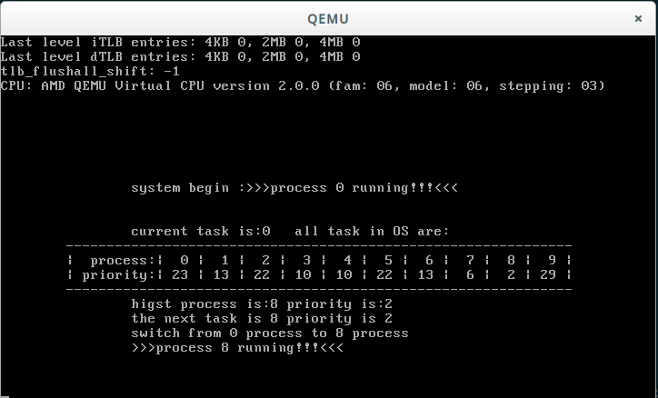

#1	Welcome to the KINK(KernelInKernel)
-------

It is a platform to write your own OS kernel,its based on Linux Kernel 3.9.4/4.1.0 source code




#2	How to Make
-------

#2.1	根目录
-------

| 目录 | 描述 |
|:-------:|:-------:|
| mykernel-3.9.4 | linux-3.9.4的构建目录 |
| mykernel-4.1.0 | linux-4.1.0的构建目录 |
| mykernel.sh | 基本的构建信息, 可以给我们基本的构建思路 |
| doc | 操作系统的文档信息 |
| os2013 | [2013年暑期补课计算机操作系统原理](https://github.com/mengning/mykernel/wiki/OS2013) |
| README.md | 帮助文档 |

##2.2	构建目录结构
-------

mykernel-3.9.4是linux-3.9.4的构建目录

mykernel-4.1.0是linux-4.1.0的构建目录

他们都采用了同样的构建方式

1.	首先将3.x和4.x内核的源代码, 下载到download目录下, 此工作由make 


| 目录 | 描述 |
|:-------:|:-------:|
| downloads | 内核源代码的下载目录 |
| kernel | 内核源代码将被解压到kernel目录 |
| patches | 我们自己kernel的补丁 |
| configs |  内核源代码的.config文件, 但是我们编译linux-3.9.4内核的时候并未使用, 而是在集结make allnoconfig |
| src | 我们内核的基本框架, 它并没有patch到内核中, 内核源代码树中的mysrc目录直接链接到了源码src中 |
| Makefile | 用于构建的Makefile |
| README.md | 文档信息 |

#2.3	makefile构建过程
-------


在构建的过程中会产生几个构建隐藏目录.stamps和.out

其中.stamps为我们的构建完成准备工作

| .stamps子目录 | 描述 |
|:-------:|:-------:|
| downloads | 用于make完成linux内核源码的下载, 内核源码下载完成后, 此文件时间戳将被更新(create/touch) |
| extract | 内核源代码下载完成后, 由extract完成内核源代码的解压缩, 将解压缩两个副本(linux-x.x.src和linux-x.x.new), 其中src是最原始的源码, 用于生成新的patch时候使用, new是我们的工作源码目录, 其中包含了一个指向了kernel源码src的链接文件mysrc |
| patch | extract完成了解压缩之后, 交由patch来完成内核补丁的添加, 完成后更新patch的时间戳(以供makefile完成依赖检查) |
| config | 最后config完成了内核.config的配置 |


#2.4	总结
-------

makefile的执行过程其实相当于执行了如下命令

以内核linux-4.1为例, 其中与linux-3.9内核有差别的地方我们会单独列出

```c
sudo apt-get install qemu # install QEMU
sudo ln -s /usr/bin/qemu-system-i386 /usr/bin/qemu
```

**下载内核源码** download Linux Kernel 4.1 source code, 源代码被下载到downloads目录下

```c
cd downloads
wget https://www.kernel.org/pub/linux/kernel/v4.x/linux-4.1.tar.xz
```

**解压缩内核源码**, 会将内核源代码解压缩到kernel目录下
```
cd download
xz -d linux-4.1.tar.xz
tar -Jxvf linux-4.1.tar -C ../kernel #被解压缩kernel/linux-4.1目录下
```

**配置内核源代码目录**, 配置出linux-4.1.new和linux-4.1.src两个目录

```c
cd ../kernel
cp linux-4.1 linux-4.1.src
mv linux.4.1 linux-4.1.new
```

**patch内核**, 用我们的start_kernel替代linux原本的start_kernel, 以完成我们自己的内核平台

```c
cd linux-4.1-new
patch -p1 < ../../patches/linux-4_1-mykernel.patch
```

**link我们的src目录**, 我们需要构建的是内核源码树linux-4.1.new目录, 而我们的内核kernel在src中, 因此将src连接到内核源码的mysrc, 这样我们在src中直接修改代码, 直接make即可 

```c
cd linux-4.1-new
ln -s ../../src mysrc
```
其中连接link和删除链接rmlink的工作可以直接交给make link/rmlink来完成, 具体请见makefile


**构建内核在目录.out中完成**, 需要构建的是内核源码树linux-4.1.new目录

我们为了保证内核源码树的清洁, 构建不再源码树中完成, 而是在.out隐藏目录完成此工作, 因此我们先创建此目录
```c
cd ../..
mkdir -p .out
```

**配置内核的BUILD构建配置文件.config**


linux-4.1需要拷贝.config
```c
cp configs/mini-x86.config .out/config
```
如果是linux-3.9.4, 我们不使用配置好的.config而是使用默认配置, 则执行如下操作

```c
make allnoconfig
```

**构建内核**, 使用O=$(pwd)/../../.out将构建任务指定到.out目录下

```c
cd kernel/linux-4.1.0.new
make O=$(pwd)/../../.out
```

**运行操作系统**, 可以使用make run直接运行, 其本质上是执行了如下命令

```c
qemu -kernel .out/arch/x86/boot/bzImage 
```

从qemu窗口中您可以看到my_start_kernel在执行，同时my_timer_handler时钟中断处理程序周期性执行。


#3	运行KINK操作系统
------

**运行操作系统**, 可以使用

```c
make run
```

直接运行, 其本质上是执行了如下命令

```c
qemu -kernel .out/arch/x86/boot/bzImage 
```


linux3.9.4的运行情况


linux4.1.0的运行情况


#4	如何生成/添加patch
-------


首先我们先删除mysrc的工作目录, 当然你也可以选择不删除, 这样的话我们自己kernel的源码也会集成到patch中, 而多数情况下, 我们希望生成的是一个纯净的patch, 一个可以被被人拿来直接穿件自己kernel的patch.


使用diff对比两个new和src两个构建目录的异同, 即可生成一个patch

```c
diff -Naur linux-4.1.src linux-4.1.new/ >linux-4.1-mykernel.patch
```
也可以直接使用make genpatch直接生成patch

将patch添加到内核中可以直接使用

```c
patch -p1 < ../../patches/linux-4_1-mykernel.patch
```

也可以使用make patch直接添加patch


#5	Comments
-------

* KernelInKernel一个短小精悍的模拟内核，在Linux内核的基础山已补丁patch的方式实现, 通过屏蔽掉linux内核的启动函数,　实现自己的start_kernel来启动一个小巧的操作系统

*	本系统在[jserv/kernel-in-kernel](https://github.com/jserv/kernel-in-kernel)(基于linux-4.1.0)和[mengning/mykernel](https://github.com/mengning/mykernel)(基于linux-3.9.4)的基础上实现, 将两者整合在一起, 借鉴了前者的makefile机制和后者的调度器.


#6	Links
-------


*	参照	[Linux内核分析期末总结](http://blog.csdn.net/pianogirl123/article/details/51287024)


* [2013年暑期补课计算机操作系统原理](https://github.com/mengning/mykernel/wiki/OS2013)

